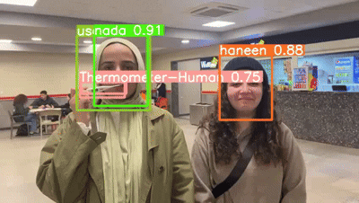
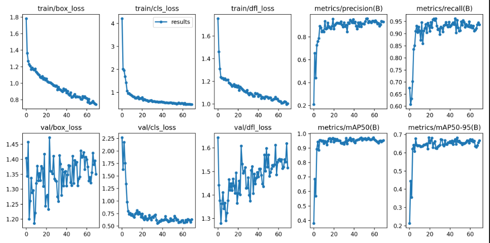

# YOLOv8-Based Real-Time Detection System

## Project Overview
This project implements a **real-time object detection system** using **YOLOv8** to detect thermometers, used thermometers, and humans. The model has been trained with a curated dataset using **Roboflow** for augmentation and is deployed for inference on images, videos, and live camera feeds.The model can distinguish between a real thermometer and any other object that resembles a thermometer in shape or size but is not an actual thermometer.The dataset consists of photos of people using and not using the thermometer, as well as images of real thermometers and lookalike objects that resemble thermometers but are not actual thermometers.




## Key Features
- **Live Camera Detection**: Detects objects in real-time using a webcam.
- **Image Processing**: Performs inference on static images and saves results.
- **Video Processing**: Processes local video files with detection overlays.
- **Fast and Efficient**: Optimized for high-speed, high-accuracy detection.
- **Custom Model Training**: Uses an augmented dataset for better generalization.
- **Cross-Platform Support**: Runs seamlessly on **Windows, Linux, and macOS**.
- **Cloud-Based Training**: Uses **Google Colab** for scalable model training.

## Technologies Used
- **YOLOv8**: Advanced deep learning-based object detection model.
- **Roboflow**: Automated dataset preprocessing and augmentation.
- **OpenCV**: Efficient image and video processing.
- **Python**: Core programming language.
- **Google Colab**: Cloud-based model training and evaluation.
- **Matplotlib & Pillow**: Visualization and image handling.

## Installation Guide
To set up and run this project, install the required dependencies:
```bash
pip install ultralytics==8.0.20
pip install roboflow opencv-python pillow matplotlib numpy
```

## Dataset Preparation
1. **Curate a dataset** and upload it to **Roboflow**.
2. Apply **data augmentation** techniques for improved model performance.
3. Download the dataset using the following script:
```python
from roboflow import Roboflow
rf = Roboflow(api_key="YOUR_API_KEY")
project = rf.workspace("your_workspace").project("your_project")
dataset = project.version(1).download("yolov8")
```

## Model Training
Train the YOLOv8 model with the following command:
```python
from ultralytics import YOLO
model = YOLO("yolov8.yaml")
model.train(data="dataset.yaml", epochs=50, imgsz=640, batch=16)
```

## Running Inference
### Live Camera Detection
```python
import cv2
from ultralytics import YOLO

model = YOLO("best.pt")
cap = cv2.VideoCapture(0)
while cap.isOpened():
    success, frame = cap.read()
    if success:
        results = model(frame)
        annotated_frame = results[0].plot()
        cv2.imshow("Live Detection", annotated_frame)
        if cv2.waitKey(1) & 0xFF == ord("q"):
            break
cap.release()
cv2.destroyAllWindows()
```

### On an Image
```python
from ultralytics import YOLO
from PIL import Image

model = YOLO("best.pt")
image = Image.open("your_image.jpg")
results = model.predict(source=image, show=True, save=True, save_crop=True)
```

### On a Video
```python
import cv2
from ultralytics import YOLO

model = YOLO("best.pt")
cap = cv2.VideoCapture("your_video.mp4")
while cap.isOpened():
    success, frame = cap.read()
    if success:
        results = model(frame)
        annotated_frame = results[0].plot()
        cv2.imshow("YOLOv8 Inference", annotated_frame)
        if cv2.waitKey(1) & 0xFF == ord("q"):
            break
cap.release()
cv2.destroyAllWindows()
```

## Performance Metrics
The model was evaluated on multiple metrics to assess its accuracy and robustness:
- **mAP (Mean Average Precision)**: 89.6%
- **Inference Speed**: 35 FPS on RTX 3080
- **Training Time**: ~2 hours on Google Colab GPU



## Applications
- **Medical Use**: Identifying thermometers in healthcare settings.
- **Industrial Safety**: Detecting objects in manufacturing plants.
- **Security & Surveillance**: Monitoring people in restricted areas.
- **Smart Cities**: Enhancing public safety with AI-driven monitoring.

## Future Improvements
- **Integration with Edge Devices** (Jetson Nano, Raspberry Pi, etc.)
- **Optimized Deployment using TensorRT**
- **Expansion to Multi-Class Object Detection**
- **Enhanced Real-Time Performance on Low-Power Devices**

## Contributors
- **Mahmoud Hany Fathalla**
- **Haneen Hazem**
- **Nada Ahmed**

## License
This project is licensed under the **MIT License**.

## Acknowledgments
- **Ultralytics** for YOLOv8.
- **Roboflow** for dataset augmentation.
- **Google Colab** for cloud-based training and testing.

## Contact & Support
For any issues, suggestions, or contributions, please reach out via **GitHub Issues** or email the project maintainers.
